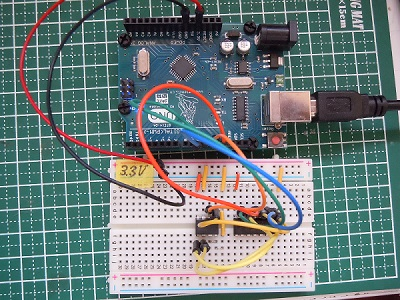
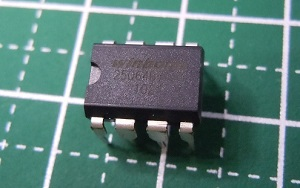
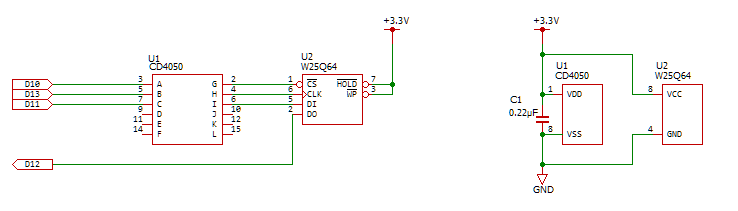
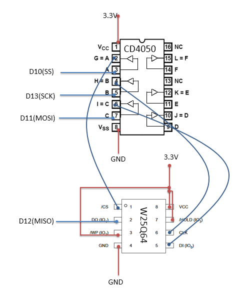
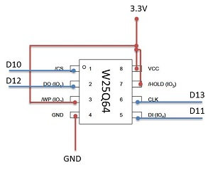
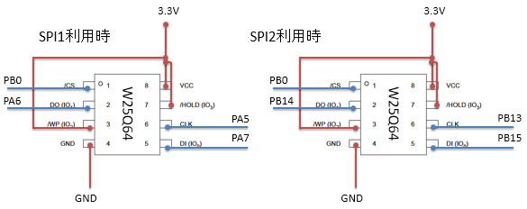
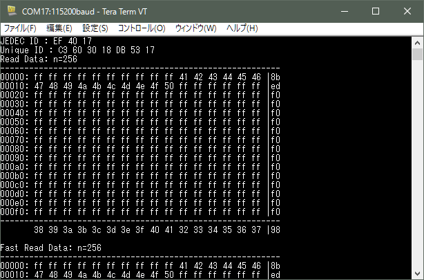

# Arduino-W25Q64
Arduino用 SPI接続フラッシュメモリW25Q64ライブラリ  

  

## 概要
Arduinoでwinbond社製 SPI接続フラッシュメモリ**W25Q64**を利用するためのライブラリです。  
**W25Q32**でも利用出来ます。  

  

ライブラリ名称: **W25Q64**  
ヘッダファイル: `#include <W25Q64.h>`  

## インストール
**W25Q64**フォルダを**Arduino IDE**の**libraries**フォルダに置いて下さい。  

## 回路図
**W25Q64**は3.3V稼働のため、5V稼働のArduinoで利用する場合はレベルシフト等の対応を行って下さい。  
(電源部のパスコンは省略しても動くようです)  

  
  

3.3V稼働可能なArduinoは直接接続で利用します。  
  

Arduino STM32 Blue Pillボードでの利用例  
利用するポートは、関数`void W25Q64_setSPIPort(SPIClass& rSPI);`で指定出来ます。  
   

## サンプルプログラム

スケッチ名：**sample.ino**  (Arduino Uno用)  
**W25Q64**に対して、書き込みと読み込みを行いその結果を表示します。    

シリアル通信の速度は115200で接続します。  
  

スケッチ名：**sample_STM32.ino**  (Arduino STM32 BluePill用)  
sample.inoと同じ機能です。  
スケッチ内の**E25Q64_SPI_PORT**の設定にて利用するSPIポートの変更が可能です。  

